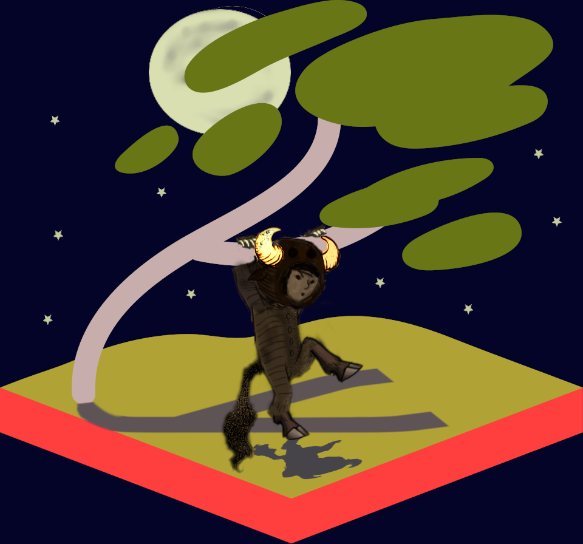

The idea struck me of using what I've come to think of as the "Guile Chil(d)",[[README.org#fn1][†]] the child in a gnu costume drawn in [[https://codeberg.org/luis-felipe/guile-graphics/src/branch/trunk/drawings][a series of illustrations in 2015 by Luis Felipe López Acevedo]] and used on the front-page of the [[https://www.gnu.org/software/guile/][Guile website]], in combination with the [[https://en.wikipedia.org/wiki/Sway_(window_manager)#/media/File:Sway_Tree.svg][Sway logo]], swinging on one of the branches of the Sway tree (making it sway?) like Max in his wolf costume in [[https://committingsociology.com/wp-content/uploads/2015/08/where-the-wild-things-are-3.jpg][that one illustration]] in [[https://en.wikipedia.org/wiki/Where_the_Wild_Things_Are][Maurice Sendak's /Where the Wild Things Are/ ]] (which I assume may have been one of the influences on López Acevedo's Guile Chil(d) illustrations), intended possibly as a logo for [Guile Swayer](https://github.com/ebeem/guile-swayer).

##+begin_html

[†:] I prefer something like Guile Chile, because it rhymes: [ɡaɪl t͡ʃaɪl]. (On *chile*, see [[https://en.wiktionary.org/wiki/chile#Etymology_2][Wiktionary, etymology 2]]).]
#+end_html

